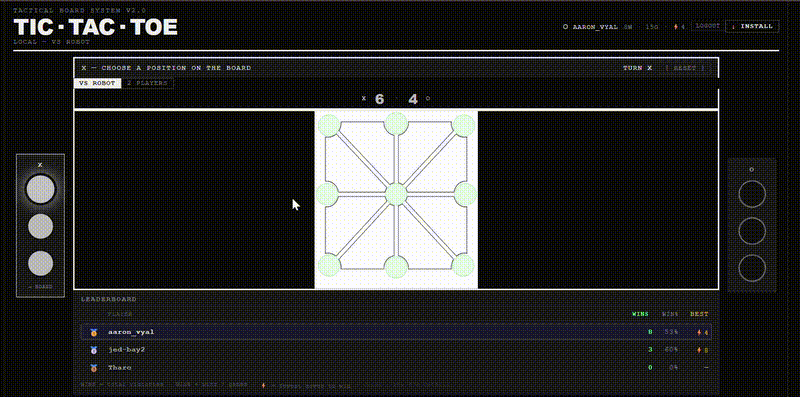
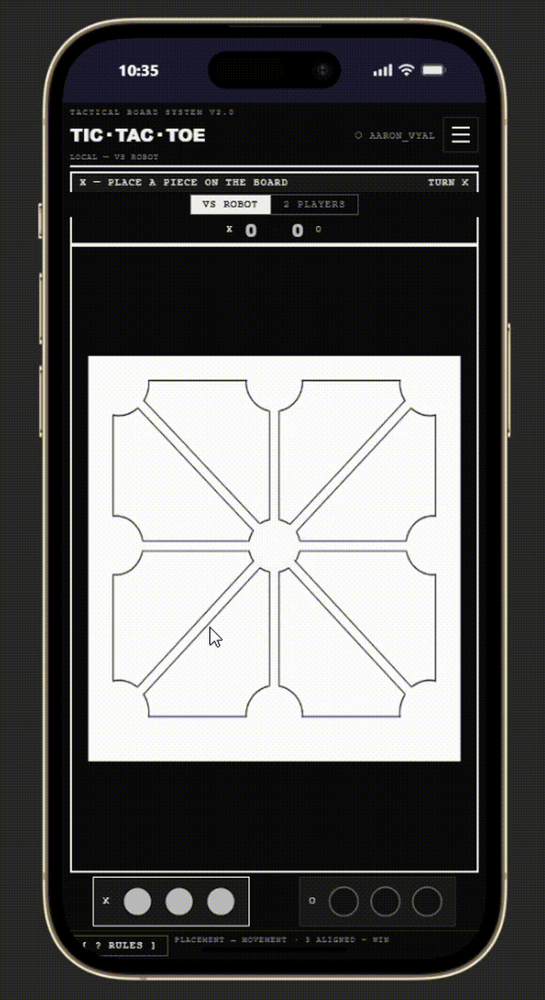

# ♟ Tic-Tac-Toe — Movable Pieces

> Not the Tic-Tac-Toe you know.

---

## Preview

| Desktop | Mobile |
|--------|--------|
|  |  |

---

## What is this?

**Tic-Tac-Toe — Movable Pieces** is a reinvention of the classic game.  
The rule that changes everything: your pieces **don't stay put**. Once placed, you can **move them** — but only to specific positions connected by a movement graph.

The center connects everything. Control it, and you control the game.

---

## How to play

The game unfolds in **two phases**:

### 1. Placement phase
Each player starts with a set of pieces in reserve.  
Take turns placing one piece at a time onto any empty position.  
This phase ends when all pieces are on the board.



### 2. Movement phase
Now the pieces come alive.  
On each turn, move one of your pieces to a **directly connected** position.  
No jumping, no free movement — every move follows the graph rules.

The goal stays the same: **line up 3 pieces** in a row, column, or diagonal.



---

## What makes it unique

- **Pieces move** — the game never locks in, everything can flip at any moment
- **The board is a graph** — each position has specific neighbors, not an open grid
- **The center is king** — it connects to every other position, making it the key strategic point
- **Real-time multiplayer** — play against someone else, live
- **Smooth animations** — pieces glide across the board

---

## The board

```
1 — 2 — 3
|\ | /|
| \|/ |
4 — 5 — 6
| /|\ |
|/ | \|
7 — 8 — 9
```

Position **5** (center) connects to all others.  
Corner positions (1, 3, 7, 9) only have 3 neighbors.  
Every move matters.

---

## Winning lines

Line up 3 pieces on any of these combinations:

| Type       | Combinations              |
|------------|---------------------------|
| Rows       | 1-2-3 · 4-5-6 · 7-8-9    |
| Columns    | 1-4-7 · 2-5-8 · 3-6-9    |
| Diagonals  | 1-5-9 · 3-5-7             |

---

## Play the game

The game is live and playable right now:

**👉 [tic-tac-toe.hakademia.dev](https://tic-tac-toe.hakademia.dev)**

---

## Want to collaborate or just say hi?

This project was designed and built by **Aaron Vyaleveka**.

Feel free to reach out:

- 🌐 Portfolio: [aaron-portfolio.hakademia.dev](https://aaron-portfolio.hakademia.dev)
- 💌 Email: [arrowvyaleveka@gmail.com](mailto:arrowvyaleveka@gmail.com)
- 💼 LinkedIn: [Aaron Vyaleveka](https://www.linkedin.com/in/aaron-vyaleveka-04877b369/)
- 🐙 GitHub: [@AaronDAmin](https://github.com/AaronDAmin)

> Whether it's to play, discuss the project, propose a collaboration, or just say hello — I'm around.

---

*Built with passion. © Aaron Vyaleveka*
